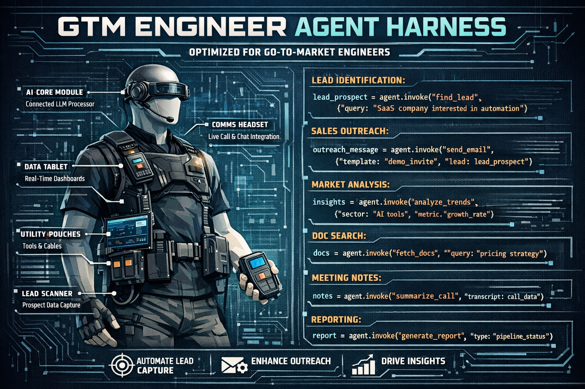

# OpenGTM



OpenGTM is an externalization-driven **agentic harness for GTM engineering and terminal-native operator work** with workflows, approvals, traces, memory, sandbox posture, skills, agents, primitives, and evals in one installable CLI.

## Why install it

OpenGTM is not a chat wrapper. It is a governed control plane for long-running GTM work and primitive-driven terminal tasks:

- **artifact-first truth** — durable artifacts instead of provider chat state
- **policy + approvals** — explicit operator control for risky actions
- **trace replay + recovery** — inspectable runs, approvals, feedback, and rollback previews
- **skills + agents** — discoverable GTM procedures and typed specialist roles
- **sandbox posture** — macOS Seatbelt/`sandbox-exec` surfaced as a first-class CLI concern
- **manual-testable UX** — a regular GitHub user can initialize, inspect, run, approve, replay, and extend the harness
- **primitive execution surface** — file, shell, web, planning, and interaction primitives are exposed directly for harness-style operation

## Install

### From npm

```bash
npm install -g opengtm
opengtm
```

### From source

```bash
git clone https://github.com/earl562/opengtm.git
cd opengtm

npm ci
npm run build
node packages/cli/bin/opengtm.js
```

## First 5 minutes

```bash
opengtm
# inside the session:
# /help
# /exit

opengtm init --name="Demo Workspace" --initiative="Q2 Pipeline"
opengtm
# inside the session:
# Research Acme
# read file packages/cli/src/oauth.ts
# search handleAuth in packages/cli/src
# Show approvals
# Why was this blocked?

opengtm status
```

## What the CLI exposes

### Interactive harness
- `opengtm`
- `opengtm help`
- `opengtm session status`
- `opengtm session transcript`
- `opengtm session new`
- natural-language GTM tasks such as `Research Acme` and `Draft outreach for Pat Example`
- coding-oriented primitive asks such as `read file packages/cli/src/oauth.ts`, `list files in packages/cli/src`, `search handleAuth in packages/cli/src`, and `run npm test`
- broader vertical intents such as `Check account health for Acme` and `Scan deal risk for Acme`
- harness queries such as `What do you know about this account?`, `What's pending?`, and `What happened last?`
- composite asks such as `Research Acme and draft outreach for Acme`
- slash commands such as `/auth`, `/provider`, `/models`, `/approvals`, `/traces`, `/memory`, `/sandbox`, `/skills`

### Operator shell / control plane
- `opengtm status`

### Workflow execution
- `opengtm workflow list`
- `opengtm workflow run <workflow-id> "<goal>"`
- `opengtm agent harness run "<goal>"`
- `opengtm approvals list|approve|deny`
- `opengtm traces list|show|replay|rerun`
- `opengtm artifacts list`
- `opengtm memory list`
- `opengtm tool list|show|search|run`

### Control plane
- `opengtm auth status|login|logout`
- `opengtm provider list|use`
- `opengtm models list|use`
- `opengtm sandbox status`
- `opengtm sandbox profile list`
- `opengtm sandbox explain --profile read-only`
- `opengtm sandbox run --preview --profile read-only -- /bin/echo sandbox-ok`

### Extension surface
- `opengtm skill list|show|new`
- `opengtm agent list|show|new`
- `opengtm agent job list|create|update`
- `opengtm agent harness run "Research Acme and draft safe follow-up"`
- `opengtm learn review`

## Current truthfulness contract

- **Canonical live workflow:** `crm.roundtrip`
- **Additional live workflows:** `sdr.lead_research`, `sdr.outreach_compose`, `cs.health_score`, `cs.renewal_prep`, `ae.expansion_signal`, `ae.account_brief`, `ae.deal_risk_scan`
- **Remaining workflow catalog:** `reference-only`
- **Sandbox runtime:** macOS Seatbelt via `sandbox-exec` when available
- **OpenAI auth path:** PKCE OAuth for the built-in OpenAI provider; API keys remain supported for custom OpenAI-compatible endpoints

> OpenGTM now supports a PKCE OAuth flow for the built-in OpenAI provider and keeps API-key auth for custom OpenAI-compatible endpoints.
>
> The built-in OpenAI model menu is a **curated default catalog**. Operators can still switch to a custom model id if the upstream catalog changes before the docs are refreshed.
>
> When a provider is configured for a workspace, OpenGTM now uses that provider in research and draft-generation paths instead of only emitting deterministic local scaffolding.

## Walkthrough

Use the full manual test flow here:

- [Install](docs/install.md)
- [Walkthrough](docs/walkthrough.md)
- [Demo](docs/demo.md)
- [Workflows](docs/workflows.md)
- [Evals & debugging](docs/evals.md)
- [Security](docs/security.md)
- [Release](docs/release.md)

## Repo layout

- `packages/cli` — operator-facing CLI, rendering, routing, control plane
- `packages/core` — domain entities and state transitions
- `packages/storage` — durable runtime store + artifacts
- `packages/providers` — model provider contracts/adapters
- `packages/skills` — GTM skill catalog + registry logic
- `packages/protocol` — typed user/tool/subagent envelopes
- `packages/evals` — smoke/benchmark/eval surfaces

## Verification

```bash
npm run typecheck
npm test
npm run build
npm run pack:check
```

## Community

- Questions: GitHub Discussions
- Security: see [SECURITY.md](SECURITY.md)
- Contributing: see [CONTRIBUTING.md](CONTRIBUTING.md)
